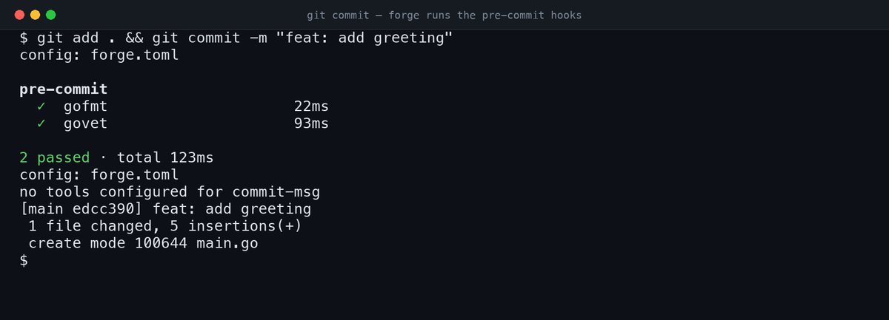

# forge

[](https://github.com/TerrorSquad/forge/actions/workflows/ci.yml)
[](https://github.com/TerrorSquad/forge/releases)
[](https://pkg.go.dev/github.com/TerrorSquad/forge)
[](LICENSE)

**The git hook runner for containerized dev.** Run your linters and formatters *inside* DDEV or Docker — automatically, no wrapper scripts. A single Go binary, no Node.js required.



## Why forge?

If your tools live inside a container — `phpstan`, `ecs`, `php-cs-fixer` in a DDEV or Docker environment — every other hook runner makes you write wrapper scripts to shell into the container. forge routes tools to the container for you: set `backend = "ddev"` (or a container name), and forge auto-detects the running environment and executes the tool where it actually lives.

It's also a solid general-purpose runner: one binary, no `package.json`, works in PHP, Go, Python, or mixed monorepos.

| Feature | forge | Husky | lint-staged | lefthook |
|---------|---------|-------|-------------|----------|
| **Runs hooks in DDEV / Docker** | ✅ | ❌ | ❌ | ❌ |
| **Commit-msg policy built in** | ✅ | ❌ | ❌ | ❌ |
| Single binary (no Node) | ✅ | ❌ (needs Node) | ❌ (needs Node) | ✅ |
| TOML config | ✅ | ❌ | ❌ | ✅ (YAML) |
| Monorepo workspace mode | ✅ | ❌ | ✅ | ✅ |
| Staged-file filtering | ✅ | ❌ | ✅ | ✅ |
| Migration from Husky | ✅ | — | — | ❌ |

The top two rows are what no other runner does — that's the reason forge exists. If you don't need container-aware hooks, lefthook is a fine choice too; forge earns its place when your toolchain lives in a container or you want commit-message policy without wiring up commitlint.

---

## Installation

### Homebrew (macOS / Linux)

```sh
brew install terrorsquad/tap/forge
```

(`terrorsquad/tap/forge-git` is the same binary under the formula's old
name, kept so existing installs keep upgrading. New installs want `forge`.)

### curl installer (Linux / macOS)

```sh
curl -fsSL https://raw.githubusercontent.com/TerrorSquad/forge/main/install.sh | sh
```

### go install

```sh
go install github.com/TerrorSquad/forge/cmd/forge@latest
```

### Manual download

Download a pre-built binary from [Releases](https://github.com/TerrorSquad/forge/releases) and place it on your `PATH`.

---

## Quick start

```sh
# 1. Create forge.toml
forge init --preset go       # or: node, php, php-node, minimal

# 2. Install git hook shims
forge install

# 3. Commit — hooks fire automatically
git commit -m "feat: my change"
```

---

## Commands

| Command | Description |
|---------|-------------|
| `forge init [--preset NAME] [--force]` | Create `forge.toml` from a built-in preset |
| `forge init --list-presets` | List available presets |
| `forge install` | Write hook shims to `.forge/hooks`, set `core.hooksPath` |
| `forge uninstall` | Remove shims and restore default `core.hooksPath` |
| `forge run <hook>` | Run a hook manually (e.g. `forge run pre-commit`) |
| `forge migrate [--from FILE] [--to FILE]` | Convert `.git-hooks.config.json` → `forge.toml` |
| `forge doctor` | Diagnose binary, config, hooks, and tool availability |
| `forge version` | Print version, commit, and build date |

---

## Configuration

`forge.toml` lives at the repo root. Copy `forge.toml.example` to get started.

### Minimal example

```toml
[hooks.pre-commit]
enabled = true

[hooks.pre-commit.tools.gofmt]
command = "gofmt"
args    = ["-w"]
type    = "system"
extensions = [".go"]
restage = true

[hooks.commit-msg]
enabled = true

[hooks.commit-msg.policy]
conventional_commits = true
```

### Tool fields

| Field | Type | Description |
|-------|------|-------------|
| `command` | string | Binary to run |
| `args` | []string | Arguments (files appended unless `pass_files = false`) |
| `type` | string | `system`, `node`, `php` — affects binary resolution |
| `backend` | string | `host`, `ddev`, or a Docker container name (overrides global default) |
| `extensions` | []string | Only run on files with these extensions |
| `include_patterns` | []string | Glob allowlist |
| `exclude_patterns` | []string | Glob blocklist |
| `pass_files` | bool | Pass staged file paths as args (default `true`) |
| `run_per_file` | bool | Invoke tool once per file instead of batch |
| `restage` | bool | `git add` modified files after tool runs |
| `on_failure` | string | `stop` to abort remaining tools on failure |
| `group` | string | Tool group name (used with `HOOKS_ONLY`) |

### Commit-message policy fields

```toml
[hooks.commit-msg.policy]
conventional_commits = true    # enforce feat/fix/chore/... prefix
append_ticket_footer = true    # append "Closes: PRJ-123" from branch name
require_ticket       = false   # fail if branch has no ticket
```

### DDEV backend

```toml
[execution]
default_backend = "ddev"   # route all tools through `ddev exec`
```

Or per tool: `backend = "ddev"` or a Docker container name like `backend = "my-app-web"`. `ddev` is auto-detected when `.ddev/config.yaml` exists and the DDEV container is running (checked via `docker inspect`).

### Monorepo workspace mode

```toml
[workspace]
members = ["apps/*", "packages/*"]
```

When staged files belong to a member directory, forge runs the hook for that member only (using the member's own `forge.toml` if present, otherwise the root config).

---

## Environment variables

| Variable | Effect |
|----------|--------|
| `SKIP_PRECOMMIT=1` | Skip the entire `pre-commit` hook |
| `SKIP_COMMITMSG=1` | Skip the entire `commit-msg` hook |
| `SKIP_PREPUSH=1` | Skip the entire `pre-push` hook |
| `SKIP_<TOOL>=1` | Skip a specific tool (e.g. `SKIP_ESLINT=1`) |
| `HOOKS_ONLY=format,lint` | Run only tools whose `group` matches |
| `FORGE_CONFIG=path` | Override config file location |

---

## Presets

| Preset | Tools |
|--------|-------|
| `node` | prettier + eslint + commit-msg policy |
| `php` | ecs (PHP-CS-Fixer) + commit-msg policy |
| `php-node` | ecs + prettier + eslint + commit-msg policy |
| `go` | gofmt + go vet + commit-msg policy |
| `minimal` | commit-msg policy only |

---

## Migrating from Husky / `.git-hooks.config.json`

```sh
forge migrate --from .git-hooks.config.json --to forge.toml
```

Reads the legacy JSON format and emits an equivalent `forge.toml`. Review and adjust before running `forge install`.

---

## License

[MIT](LICENSE)

## Build

```bash
go build -o forge ./cmd/forge
```

## Quick Start

```bash
# 1) Build or install forge on PATH
go build -o forge ./cmd/forge
mv forge /usr/local/bin/

# 2) In a git repo
forge init
forge install

# 3) Verify
forge doctor
```

After `forge install`, git `core.hooksPath` is set to `.forge/hooks`.
Git automatically executes hook shims there on commit/push.

If the repo has `.forge` committed, users still need to run `forge install` after cloning so local git config is updated.
If `.forge` is missing, `forge install` creates it and writes the hook shims.

## Commands

```text
forge init [--force]
forge install
forge uninstall
forge run <hook> [--edit FILE]
forge doctor
```

## Hook Behavior

- `pre-commit`
  - reads staged files (`git diff --cached --name-only --diff-filter=ACMR`)
  - filters files by configured extensions/patterns
  - runs tools in the order they are declared in `forge.toml`
  - re-stages files for tools with `restage = true`
- `commit-msg`
  - validates conventional commit subject (if enabled)
  - appends `Closes: TICKET` from branch name (if enabled)
- `pre-push`
  - runs configured tools (no staged-file filtering unless tool needs files)

## Environment Variables

- `FORGE_CONFIG`: custom config file path
- `HOOKS_ONLY`: comma-separated tool groups (example: `lint,format`)
- `SKIP_PRECOMMIT`, `SKIP_PREPUSH`, `SKIP_COMMITMSG`: skip whole hook
- `SKIP_<TOOL_NAME>`: skip specific tool, normalized to uppercase snake case

Examples:

```bash
HOOKS_ONLY=lint git commit -m "fix: lint only"
SKIP_PHPSTAN=1 git commit -m "chore: bypass phpstan"
```

## Config File (`forge.toml`)

Generated starter config:

```toml
[hooks.pre-commit]
enabled = true

[hooks.pre-commit.tools.prettier]
command = "prettier"
args = ["--write", "--ignore-unknown"]
extensions = [".js", ".ts", ".json", ".md"]
restage = true
group = "format"

[hooks.commit-msg]
enabled = true

[hooks.commit-msg.policy]
conventional_commits = true
append_ticket_footer = true
require_ticket = false
```

## Design notes

Execution is deliberately simple: tools run sequentially, configured by data
rather than by a plugin API. Nothing here needs a scripting host, which is what
keeps forge a single binary you can drop onto a CI runner.

## Contributing

Issues and PRs welcome. For anything larger than a bug fix, please
[open an issue](https://github.com/TerrorSquad/forge/issues) first so the
approach can be agreed before you write it. Commits follow
[Conventional Commits](https://www.conventionalcommits.org/) — forge enforces
this on itself.

## License

[MIT](LICENSE) © Goran Ninković
