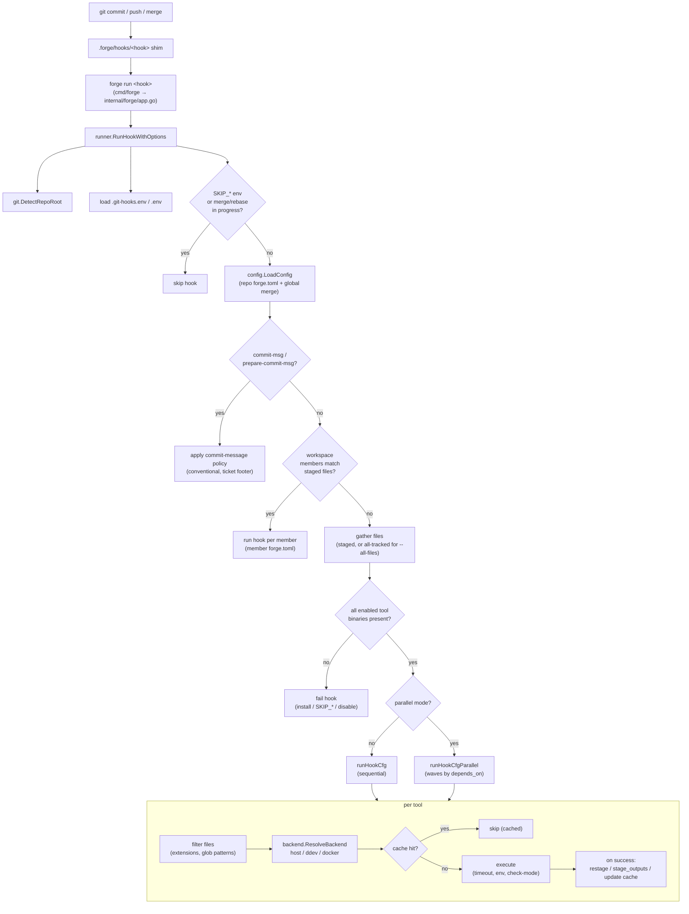

# Architecture

How a git operation flows through forge, and what each package owns.

## Request pipeline

## Package map

| Package | Responsibility |
|---------|----------------|
| `cmd/forge` | Binary entry point; calls `forge.Run(args)` |
| `internal/forge` (`app.go`) | CLI dispatch for every subcommand; also `install`, `uninstall`, `doctor`, `validate`, `completion` |
| `internal/forge/config` | Load/parse/merge `forge.toml`, presets, Husky migration, remote presets, global-config merge |
| `internal/forge/runner` | Core execution: file filtering, sequential + parallel runners, commit-message policy, run cache, workspace routing |
| `internal/forge/backend` | Execution abstraction — `HostBackend`, `DdevBackend`, `DockerBackend`; DDEV auto-detection |
| `internal/forge/git` | Repo-root detection, staged/tracked file listing, `git add`, sequencer-state checks |
| `internal/forge/ui` | Terminal output (colors, spinners) and the plain CI variant |
| `internal/forge/update` | Self-update from GitHub releases |

## Key invariants

- **Tool order** follows declaration order in `forge.toml`. Go maps don't preserve order, so `config.parseHookToolOrder` regex-scans the raw TOML and feeds `OrderedToolNames()` — never rely on map iteration for ordering.
- **Backend resolution precedence**: per-tool `backend` → `[execution].default_backend` → DDEV auto-detect (if the container is running) → host.
- **Preflight before execution**: every enabled (non-skipped) tool's binary must resolve before any tool runs; a missing host binary aborts the whole hook. Container backends are assumed to provide their own binaries.
- **Mutations happen only on success**: `restage` and `stage_outputs` run after a tool passes (never in `--check` mode); the run cache is only written for passing tools.
- **Config precedence**: `FORGE_CONFIG` → repo `forge.toml`, with the global user config (`~/.config/forge/config.toml`) merged underneath — repo values always win.
